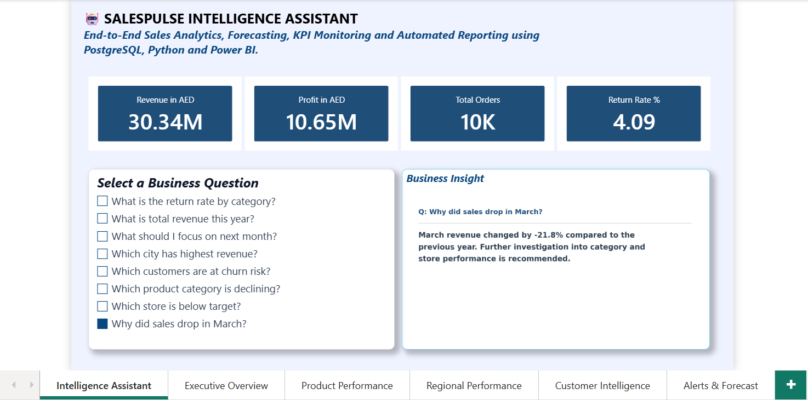
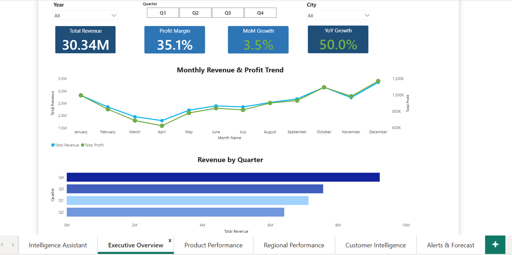
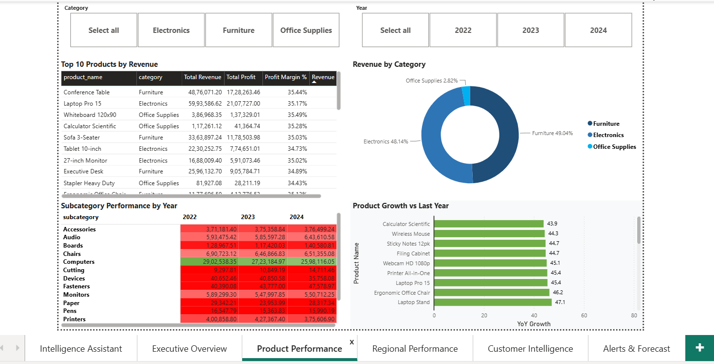
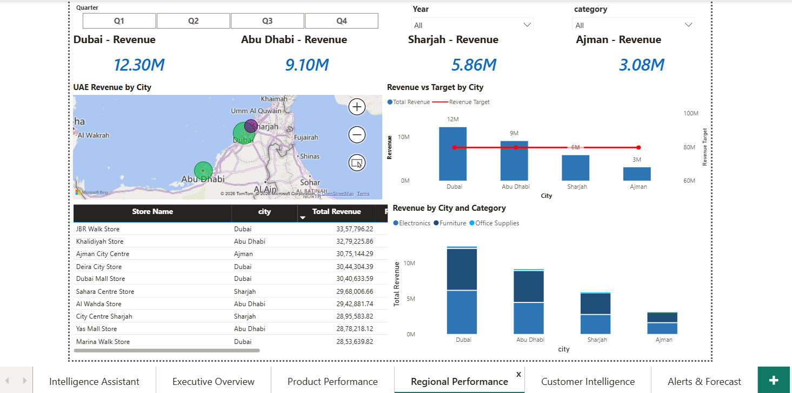
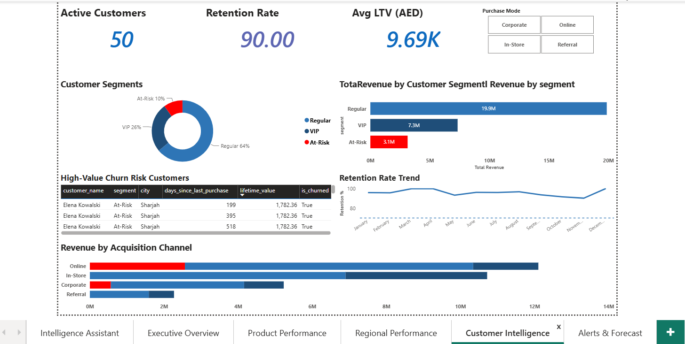
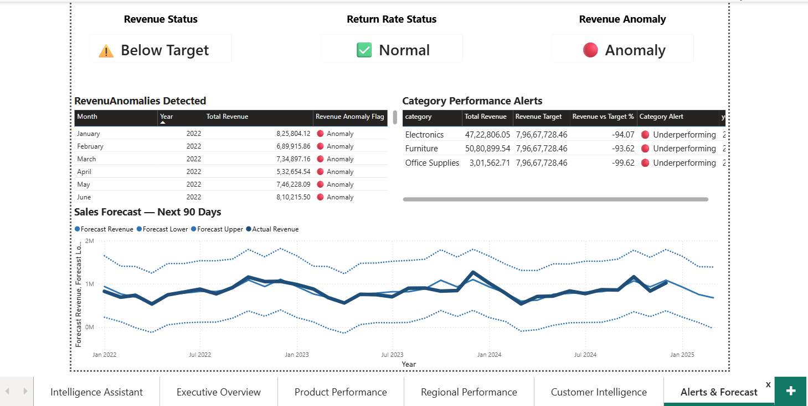

# 🤖 SALESPULSE INTELLIGENCE ASSISTANT

### End-to-End Sales Analytics, Forecasting, KPI Monitoring and Automated Reporting using PostgreSQL, Python and Power BI



---

# 📌 Project Overview

SalesPulse Intelligence Assistant is a modern Business Intelligence platform designed to help organizations monitor sales performance, identify business opportunities, forecast future trends, and automate reporting.

The solution combines PostgreSQL, Python, Power BI, Forecasting Models, Data Quality Monitoring, and Automated Reporting into a single analytics ecosystem that enables faster and smarter business decisions.

---
# 🎥 Project Demo

Watch the 90-second walkthrough of the SalesPulse Intelligence Assistant:

▶️ https://www.loom.com/share/a20d870365f3457db991158381f325db

---
# 🎯 Problem Statement

Every business—Retail, Logistics, Finance, Real Estate, Aviation, Healthcare, and E-Commerce—has a sales team.

However, most organizations still rely on manual reporting processes.

### Traditional Process

```text
Manager asks analyst for sales numbers
                ↓
Analyst spends 2–3 days pulling data from multiple sources
                ↓
Analyst builds Excel reports manually
                ↓
Manager receives report several days later
                ↓
Business issue already worsened
                ↓
Decision made too late
```

This results in:

- Delayed decision making
- Manual reporting effort
- Data inconsistencies
- Lost revenue opportunities
- Poor visibility into business performance

---

# 💡 Solution

SalesPulse Intelligence Assistant automates the entire analytics workflow.

### Business Transformation

| Traditional Process | SalesPulse Solution |
|--------------------|--------------------|
| Question asked Monday | Manager opens dashboard instantly |
| Analyst pulls data Tuesday | Data already available in PostgreSQL |
| Report built Wednesday | KPIs calculated automatically |
| Summary written Thursday | Insights generated instantly |
| Decision made Friday | Decision made within seconds |

---

# 🚀 Business Benefits

| Benefit | Impact |
|----------|----------|
| Faster Decision Making | Minutes instead of days |
| Automated Reporting | Eliminates manual reporting effort |
| Executive Visibility | Real-time KPI monitoring |
| Forecasting | Predict future sales trends |
| Data Quality Monitoring | Detect issues before reporting |
| Scalability | Supports growing business operations |

---

# 🏗️ Solution Architecture

```text
                     ┌─────────────────┐
                     │  Superstore CSV │
                     └────────┬────────┘
                              │
                              ▼
                 ┌─────────────────────────┐
                 │ PostgreSQL Data Warehouse│
                 └────────┬────────────────┘
                          │
             ┌────────────┼─────────────┐
             │            │             │
             ▼            ▼             ▼

      KPI Queries    Data Quality    Forecasting
         (SQL)         Checks          Models

             │            │             │
             └────────────┼─────────────┘
                          │
                          ▼

                ┌─────────────────┐
                │ Python Analytics│
                └────────┬────────┘
                         │
                         ▼

                ┌─────────────────┐
                │ Power BI Report │
                └────────┬────────┘
                         │
                         ▼

             Executive Decision Making
```

---

# 📊 Dashboard Pages

### 1️⃣ Executive Overview

Provides high-level KPIs:

- Revenue
- Profit
- Total Orders
- Return Rate
- Sales Trend
- Monthly Performance

---

### 2️⃣ Product Performance

Provides:

- Top Products
- Category Performance
- Product Profitability
- Return Analysis

---

### 3️⃣ Regional Performance

Provides:

- Revenue by Region
- Profit by Region
- Regional Ranking
- State-wise Analysis

---

### 4️⃣ Customer Intelligence

Provides:

- Top Customers
- Customer Segmentation
- Revenue Contribution
- Customer Trends

---

### 5️⃣ Alerts & Forecast

Provides:

- Revenue Forecast
- Sales Trend Prediction
- Anomaly Detection
- Business Alerts

---

### 6️⃣ SalesPulse Intelligence Assistant

Business users can ask questions such as:

- Which city has the highest revenue?
- Which category has the highest return rate?
- What is the monthly revenue trend?
- Which customers are at churn risk?
- Why did sales drop in March?
- Which product category is declining?
- Which store is below target?

---

# 🖼️ Dashboard Screenshots

## Intelligence Assistant


---

## Executive Overview



---

## Product Performance



---

## Regional Performance



---

## Customer Intelligence



---

## Alerts & Forecast



---

# 🧠 Example Business Questions

| Business Question | Business Value |
|-------------------|----------------|
| Which city has highest revenue? | Identify top-performing markets |
| Which category is declining? | Prevent future revenue loss |
| Which customers are at churn risk? | Improve customer retention |
| Why did sales drop in March? | Root cause analysis |
| Which products have highest returns? | Improve product quality |
| Which store is below target? | Performance monitoring |

---

# 📈 Advanced Analytics

### Revenue Forecasting

Predict future sales performance using statistical forecasting models.

### Anomaly Detection

Identify unusual spikes or drops in revenue automatically.

### Automated KPI Monitoring

Track business KPIs without manual intervention.

### Data Quality Validation

Validate source data before reporting.

---

# ⚙️ Technology Stack

| Layer | Technology |
|---------|-----------|
| Visualization | Power BI |
| Database | PostgreSQL |
| Query Language | SQL |
| Data Processing | Python |
| Data Manipulation | Pandas |
| Forecasting | Prophet |
| Machine Learning | Scikit-Learn |
| Excel Automation | OpenPyXL |
| Version Control | Git & GitHub |

---

# 📂 Project Structure

```text
salespulse/
│
├── README.md
│
├── data/
│   ├── Dim_Budget_Targets.csv
│   ├── Dim_Customer.csv
│   ├── Dim_Date.csv
│   ├── Dim_Product.csv
│   ├── Dim_Store.csv
│   ├── Fact_Customer_Activity.csv
│   └── Fact_Sales.csv
│
├── sql/
│   ├── schema.sql
│   ├── kpi_queries.sql
│   └── data_quality.sql
│
├── etl/
│   └── load_data.py
│
├── intelligence assistant/
│   └── sales_assistant.py
│
├── analytics/
│   ├── forecasting.py
│   └── forecast.csv
│
├── reports/
│   ├── excel_export.py
│   └── SalesPulse_Weekly_Report.csv
│
├── screenshots/
│   ├── intelligence_assistant.png
│   ├── executive_overview.png
│   ├── product_performance.png
│   ├── regional_performance.png
│   ├── customer_intelligence.png
│   └── alerts_forecast.png
│
└── dashboard/
    └── SalesPulse_Dashboard.pbix
```

---

# 📌 Future Enhancements

- Power Automate Integration
- Email-Based KPI Reports
- Microsoft Teams Alerts
- Real-Time Data Refresh
- Mobile Dashboard Support
- Executive Alert System

---

# 👩‍💻 Author

Janani Thirugnanasambandam

Business Intelligence | Data Analytics | Power BI | SQL | Python | PostgreSQL
